# Predicting Prices for Houses in King County, WA

**Authors: Jesse Markowitz, Dillon Medd, Ronak Parekh**

## Overview

Home buyers in King County, WA, must weigh several factors when purchasing a house, balancing budget, location, size, and ovearall quality. King County includes Seattle and is the most populous county in the state of Washington. However, it also contains large rural and mountainous areas to the east, stretching to the Cascade Range. This provides a lot of choice and variety to prospective bome buyers.

In this analysis, we seek to identify the most important factors that contribute to the price of a home so that home buyers in King County can set reasonable expectations and make informed assumptions about what they will find.

### Business problems/questions

What features correlate most with price? How does distance from the Seattle city center affect the price per square foot of a house?

Analysis and modeling through regression yield the following factors as predictive of house prices in King County:
 - Square footage of the house
 - Grade based on [King County grading system](https://info.kingcounty.gov/assessor/esales/Glossary.aspx?type=r#b)
 - Distance from Seattle city center

Together, these factors account for 72% of the variance in home prices in the county.

## Data Understanding

We identify these features through exploratory data analysis using housing sales data from King County. This dataset includes the sale price and a variety of features for houses sold in the county from May 2014–May 2015.

### Visualizations

The correlation heatmap matrix below identifies `sqft_living`, `grade`, and `sqft_living_15` as strongly correlated with `price`.

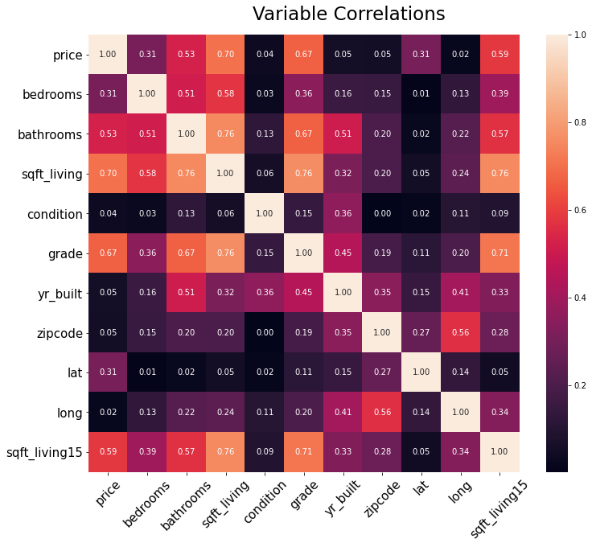

The distributions for `price` and `sqft_living` are heavily skewed right by outliers. Rather than drop these homes from the dataset, we instead log-transform these variables.

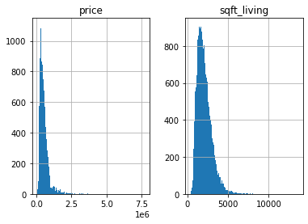

Factors like the age of a house (here given via `yr_built`) and the general `condition` are often major considerations for prospective home buyers. Let's compare these variables with `grade`, which denotes the construction quality, design, and adherance to building codes--a variable that (from the heatmap above) we already know correlates strongly with price.

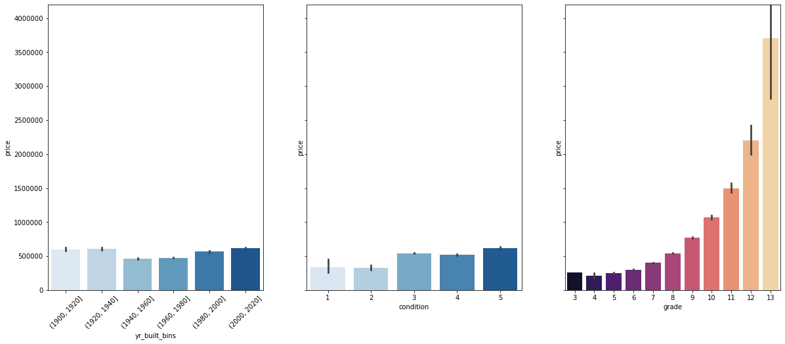

Clearly, age (year built) has little impact on the price of a house. Condition does somewhat, although it's worth noting that very few houses are in the 1-2 range; the majority are in category 3. Grade has an enormouse impact (although very few houses are in the 12-13 range, which denotes high-quality, custom-built and -designed houses).

### Feature engineering

After noticing that many of the most expensive homes in the dataset had Seattle zip codes, we decided to investigate the relationship between distance from Seattle's city center and price of home. 

Haversine Distance function returns distance (in kilometers) when given two locations longitude and latitude. *[Source](https://towardsdatascience.com/heres-how-to-calculate-distance-between-2-geolocations-in-python-93ecab5bbba4)*

The Distance From City Center function returns a given location's distance from the center of Seattle. We use the function to create a new feature (column) in the DataFrame, then check the correlations with our new features.

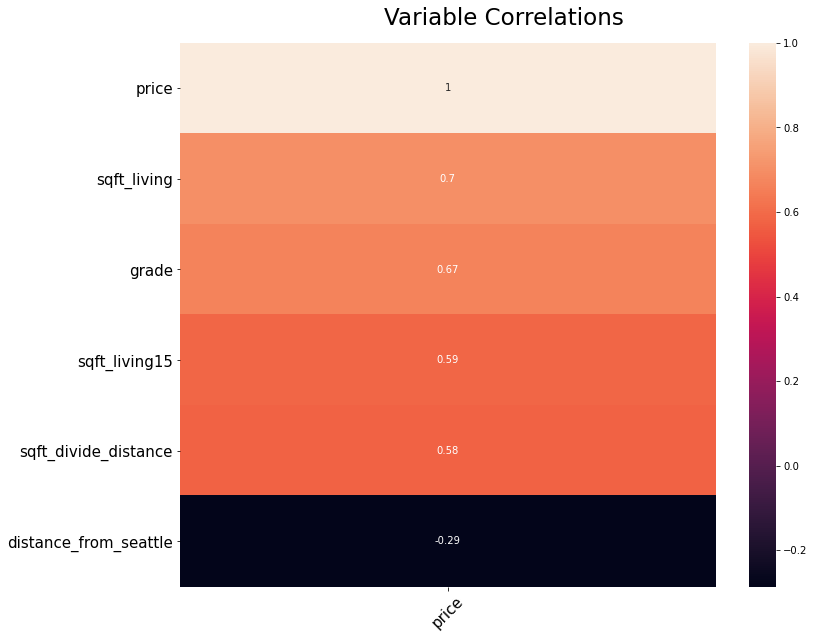

As expected, `distance_from_seattle` has a negative correlation with price. The farther out from the city you are (higher distance), the lower the price overall tends to be (and the lower the price per square foot).

Now let's split the dataset into `city`, `suburb`, and `rural` homes.  Using google maps we approximated the ranges for city (<12 km), suburb(12-25km), and rural (25+km) homes. If we run a series of simple linear regression with `sqft_living` as the only factor on `price`, disaggregated by location (`city`, `suburb`, and `rural`), we can evaluate the slope of each model. The slope represents price per square foot.

 - Coefficient for city: 408.127
 - Coefficient for suburb: 255.370
 - Coefficient for rural: 192.927
 
This shows that the price per square foot is highest in the city, decreasing as the distance from the city center increases.

## Visualization: Impact of location on square footage

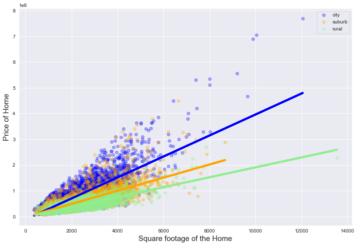

The visualization above shows the relationship between square footage of the house and price within the three different locations. 

## Distribution of house prices by location

Here we take a look at the distribution of house prices within each location subset.

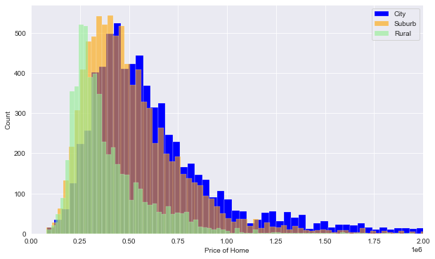

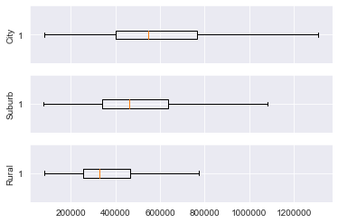


## Modeling

Now let's put it all together to create a model that predicts house prices for King County, WA.

### Baseline Model

The simplest model is one that uses only size ($log$(`sqft_living`)) to predict the price ($log$(`price`)) of a house. We begin with this baseline for model validation, comparing this model to the model based on the features explored and engineered above.

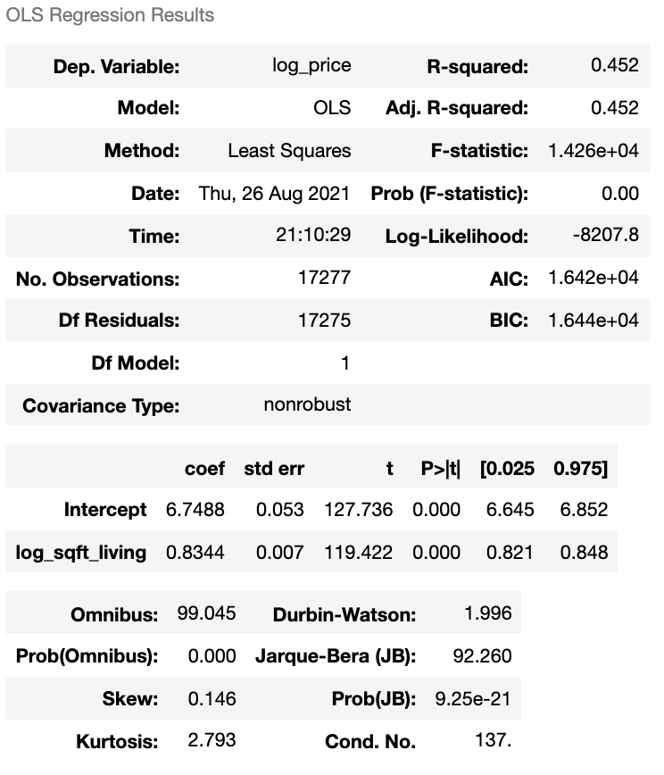

The baseline model has an $r^2$ of 0.452. Below we check residuals and mean square error.

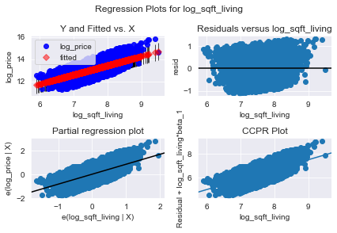
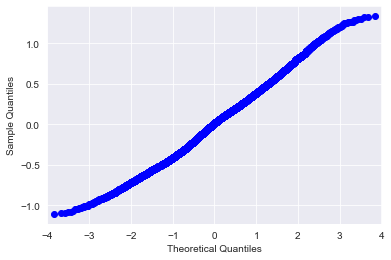

 - Baseline mse on training data:  0.1514145280654338
 - Baseline mse on testing data:   0.14936244222233772
 
The Q-Q plot suggests our model and data adhere to assumptions of linearity. Our mse values are similar for both training and testing data, indicating our model is neither over nor under fit.

### Model including identified and engineered features.

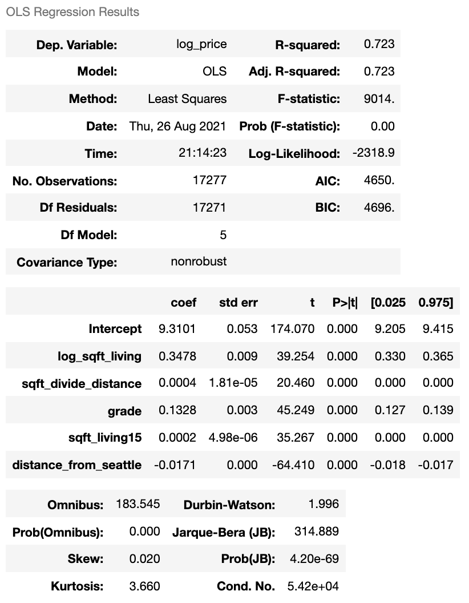

This model shows a great improvement over our baseline. The $r^2$ is 0.723, which indicates our model accounts for 72% of the variance in house prices.

Let's check residuals and mean square error again:

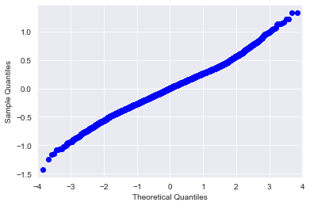

 - Baseline mse on training data:  0.0765781972426975
 - Baseline mse on testing data:   0.07597046311166614
 
The Q-Q plot is still close to linearity. The mse values have improved dramatically--nearly cut in half from the baseline model. The similar scores between training and testing mse continue to suggest our model has consistent predictive power for seen and unseen data.


## Conclusions

Our final model shows that price is affected most by square footage, grade, square footage of neighboring houses, and distance from Seattle city center.
The model accounts for 72% of variance in housing prices (r2 = 0.723) 
and has consistent predictions for both training and unseen data.

 - Price per square foot is largely predicted by distance from Seattle city center
    - Higher in the city, lower farther out
 - Buyers must balance optimal size and location for their budget
 - Grade (structural quality) matters more than age or condition

**Next steps:**
 - Compare recent sale price to original purchase price to determine trends and identify good areas for investment
 - For a given budget, identify for buyers affordable house size (ft2) by location
 - Use more detailed mapping to identify homes in urban, suburban, and rural areas.

## For More Information

See the full analysis in the [Jupyter Notebook](./predicting_prices_king_county_jupyternb.ipynb) or review this [presentation](./predicting_prices_king_county_presentation.pdf)

```
├── Code
│   ├── Markowitz_working_nb.ipynb
│   ├── Ronak Notebook.ipynb
│   ├── Dillon Eda.ipynb
│   ├── Dillon_final_nb.ipynb
│   
├── Data
├── Images
├── predicting_prices_king_county_jupyternb.ipynb
├── predicting_prices_king_county_presentation.pdf
└── README.md
```

